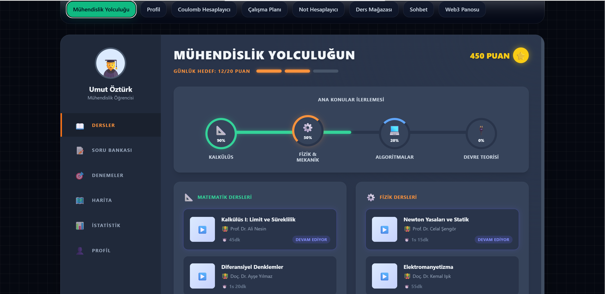
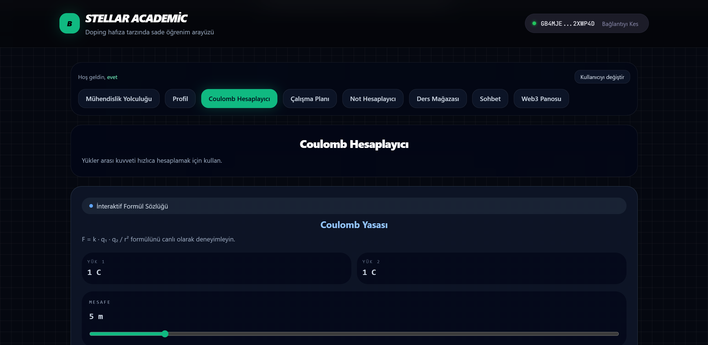
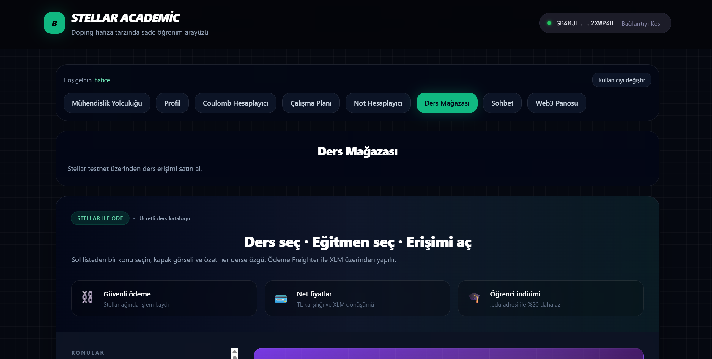
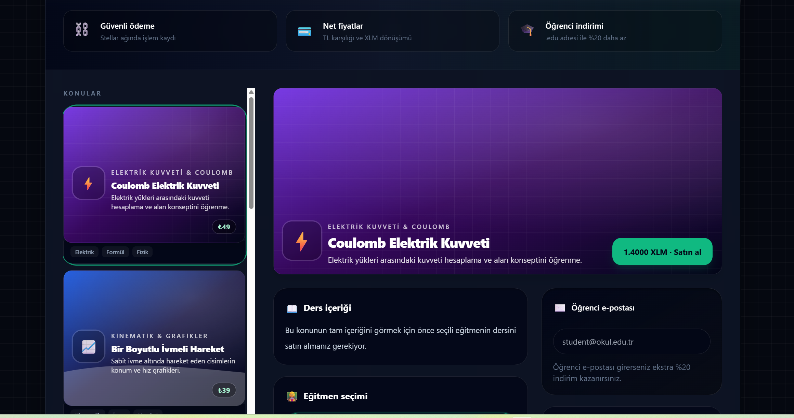
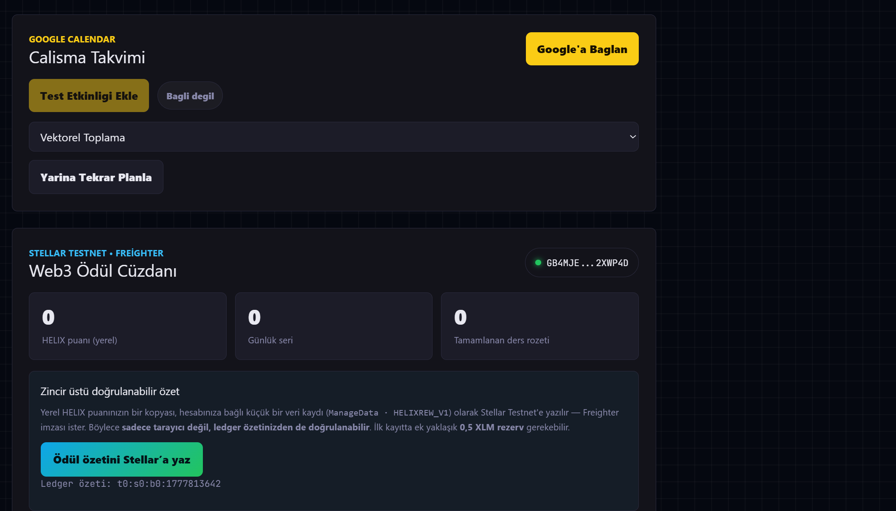
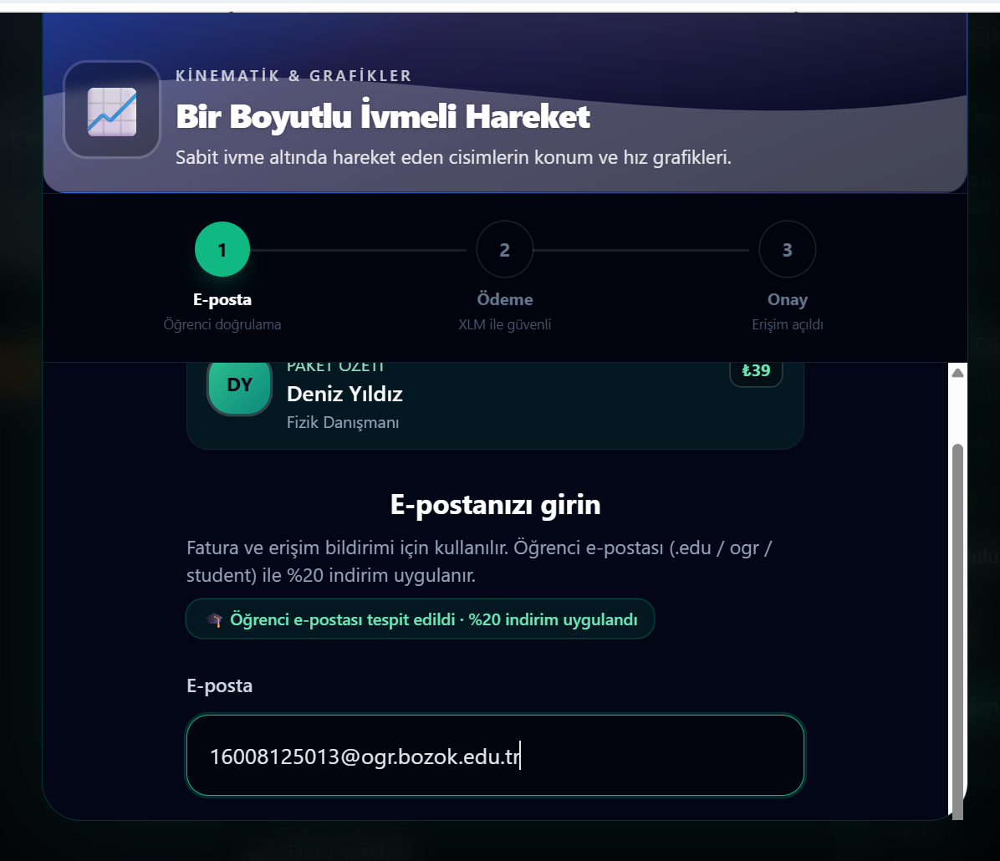

# Helix — Stellar Academic

> **Stellar Academic**: A full-stack sample application that connects to the Stellar Testnet via Freighter, uses physics learning modules, and employs **classic XLM payment (Horizon)** in the **Purchase** flow. Optional **Soroban** contract IDs are enabled via `.env`; the flow is also designed to work without any contract deployment.

---

## 🔗 Live Testnet Proof

|                      |                                                                                                                                                                                   |
| -------------------- | --------------------------------------------------------------------------------------------------------------------------------------------------------------------------------- |
| **Account**          | [`GB2TA6IWKCRTWUWGB65V6AOJFL5VOJKQC2HFGKJ4BPUPQFCUIBA75KDY`](https://stellar.expert/explorer/testnet/account/GB2TA6IWKCRTWUWGB65V6AOJFL5VOJKQC2HFGKJ4BPUPQFCUIBA75KDY)            |
| **Transaction Hash** | [`287e4f8b9332201016affa01daa57357ed968e205c304f730c56ee9f0253323e`](https://stellar.expert/explorer/testnet/tx/287e4f8b9332201016affa01daa57357ed968e205c304f730c56ee9f0253323e) |
| **Network**          | Stellar Testnet                                                                                                                                                                   |

> This transaction demonstrates a live XLM payment processed through Freighter on the Stellar Testnet as part of the course purchase flow.

---

## Table of Contents

1. [What is Stellar?](#1-what-is-stellar)
2. [What is Blockchain?](#2-what-is-blockchain)
3. [What is XLM (Lumen)?](#3-what-is-xlm-lumen)
4. [What is a Wallet?](#4-what-is-a-wallet)
5. [What is Freighter?](#5-what-is-freighter)
6. [What is a Smart Contract?](#6-what-is-a-smart-contract)
7. [What is Soroban?](#7-what-is-soroban)
8. [How is Stellar Coded?](#8-how-is-stellar-coded)
9. [Testnet vs Mainnet](#9-testnet-vs-mainnet)
10. [Project Architecture](#10-project-architecture)
11. [Windows Setup](#11-windows-setup)
12. [Linux Setup](#12-linux-setup)
13. [Running the Project](#13-running-the-project)
14. [Deploying the Smart Contract](#14-deploying-the-smart-contract)
15. [Project File Structure](#15-project-file-structure)
16. [API Reference](#16-api-reference)
17. [FAQ](#17-faq)
18. [Environment Variables (Summary)](#18-environment-variables-summary)

---

## 1. What is Stellar?

**Stellar** is an open-source **decentralized payment network** founded in 2014 by **Jed McCaleb** and **Joyce Kim**. Its goal is to give unbanked people the ability to convert between different currencies quickly and cheaply.

### What Makes Stellar Special?

| Feature          | Stellar                    | Traditional Bank Transfer |
| ---------------- | -------------------------- | ------------------------- |
| Transaction time | ~3–5 seconds               | 1–5 business days         |
| Transaction fee  | ~0.00001 XLM (nearly zero) | 5–50 USD                  |
| Operating hours  | 24/7                       | Business hours only       |
| Geographic limit | None                       | Varies by country         |
| Intermediary     | None (decentralized)       | Bank, SWIFT network       |

### Use Cases for Stellar

- **Remittances:** Send money abroad cheaply and quickly
- **Tokenization:** Convert real-world assets (real estate, stocks, gold) into digital tokens
- **Micro-payments:** Pay content creators in small amounts
- **DeFi (Decentralized Finance):** Lend and borrow without a bank
- **Enterprise payments:** Companies like MoneyGram and IBM use Stellar infrastructure

### Stellar Development Foundation (SDF)

The development of Stellar is driven by the **Stellar Development Foundation (SDF)**, a non-profit organization ensuring the network remains open and accessible.

---

## 2. What is Blockchain?

To understand blockchain, first imagine a classic database: a bank stores "Ali has 1000 TL in his account" on its own server. We trust the bank because it manages those records.

**In blockchain, that record is distributed across thousands of computers.** There is no central authority.

### How Does It Work?

```
[Transaction occurs]
        ↓
[Transaction is broadcast to network computers]
        ↓
[Computers (validators) verify the transaction]
        ↓
[Approved transaction is added to a "block"]
        ↓
[Block is appended to the chain → immutable]
```

### Core Properties of Blockchain

- **Transparency:** All transactions are publicly visible
- **Immutability:** Added data cannot be deleted or changed
- **Decentralization:** Thousands of computers, not a single server
- **Trust:** You don't need to trust an institution to trust the system

### Stellar's Consensus Mechanism: SCP

Stellar uses the **Stellar Consensus Protocol (SCP)** to validate transactions. There is no energy-intensive "mining" (as in Bitcoin). Instead, trusted validator nodes vote to approve transactions. This makes Stellar very fast and eco-friendly.

---

## 3. What is XLM (Lumen)?

**XLM** is the native cryptocurrency of the Stellar network, also known as "Lumen."

### Roles of XLM

**1. Paying Transaction Fees**
Every Stellar transaction requires a tiny XLM fee (0.00001 XLM ≈ 0.000003 USD). This fee prevents spam.

**2. Minimum Balance (Base Reserve)**
A Stellar account must hold at least **1 XLM** to remain active. Each additional entry (trustline, data entry, etc.) requires +0.5 XLM. This protects the network from unnecessary accounts.

**3. Bridge Currency**
For example, if there's no direct TRY → USD market, the system can automatically use the TRY → XLM → USD path.

### How to Get XLM

- **For Testnet (free):** Receive test XLM via Friendbot
- **For Mainnet:** Purchase on exchanges like Binance or Coinbase

---

## 4. What is a Wallet?

A crypto wallet is different from a traditional wallet. **It doesn't store the money itself — it stores your keys to access the money.**

### Wallet Components

```
┌─────────────────────────────────────────────────────┐
│                   STELLAR ACCOUNT                    │
│                                                     │
│  Public Key:                                        │
│  GABC...XYZ  ← Like your bank account number        │
│               Can be shared with anyone             │
│                                                     │
│  Secret Key / Private Key:                          │
│  SABC...XYZ  ← Like your PIN / password             │
│               NEVER SHARE WITH ANYONE!              │
└─────────────────────────────────────────────────────┘
```

### Wallet Types

| Type                  | Example      | Security  | Convenience |
| --------------------- | ------------ | --------- | ----------- |
| **Browser Extension** | Freighter    | Medium    | High        |
| **Desktop App**       | Solar Wallet | Good      | Medium      |
| **Hardware Wallet**   | Ledger       | Very High | Low         |
| **Paper Wallet**      | Printed key  | Very High | Very Low    |
| **Exchange Wallet**   | Binance      | Low\*     | Very High   |

> \*On exchange wallets, the private key is not yours. "Not your keys, not your coins."

### What Can You Do With a Wallet?

- Send and receive XLM and other Stellar assets
- Interact with smart contracts
- Open trustlines to tokens
- Sign transactions

---

## 5. What is Freighter?

**Freighter** is a free **browser wallet extension** built for the Stellar network. It does for Stellar what MetaMask does for Ethereum.

### Freighter Features

- Works on Chrome, Firefox, and Brave
- Manages multiple accounts
- Easy switching between Testnet / Mainnet
- Secure connection to web applications
- Shows transactions to the user before signing

### How Freighter Works

```
Web Application          Freighter            Stellar Network
     │                       │                      │
     │── "Sign Transaction" ►│                      │
     │                       │ Ask User             │
     │                       │ [Approve] / [Reject] │
     │  ◄── Signed XDR ────  │                      │
     │                       │                      │
     │──────────────── Send Signed Transaction ────►│
```

The application never has access to your secret key. Freighter only returns the signed transaction.

### Installing Freighter

1. Go to the Chrome Web Store
2. Search for "Freighter Wallet"
3. Click "Add to Chrome"
4. Once installed:
   - Create a new wallet or import an existing key
   - **Save your secret key somewhere safe!**
   - Settings → Network → Select **Testnet**

---

## 6. What is a Smart Contract?

A **smart contract** is a computer program that runs on a blockchain. Like a regular contract, it contains rules — but those rules are enforced automatically, without any intermediary.

### Classic Contract vs Smart Contract

```
Classic Contract:
  Ali → Send Money → Bank → Verify → Mehmet
                      ↑
               Trust the intermediary

Smart Contract:
  Ali → Condition Met? → Yes → Auto Transfer → Mehmet
              ↑
         Code guarantee (immutable)
```

### Real-Life Example

**If a rental agreement were a smart contract:**

- Rent is automatically deducted from the tenant's account on the 1st of each month
- The landlord provides a door code; it keeps working as long as rent is paid
- If payment is missed, the code is automatically revoked
- Neither landlord, tenant, nor lawyer needs to manage the process

### Smart Contract in This Project

This project includes a **counter contract** as a simple example:

- Stores a number on the blockchain
- Anyone can increment or decrement it
- Only the admin can reset it
- All changes are permanent on the blockchain — nobody can delete them

### Advantages of Smart Contracts

- **Trust:** What the code will do is known in advance
- **Transparency:** Source code is open to everyone
- **Automation:** No human intervention required
- **Cost:** No intermediary commission

---

## 7. What is Soroban?

**Soroban** is Stellar's smart contract platform, integrated into the Stellar network in 2023.

### Soroban's Technical Foundation

Soroban contracts are compiled into **WebAssembly (WASM)** format and run on the Stellar network. WebAssembly is a modern binary format standard designed for speed, security, and portability.

```
Rust Code (.rs)
      ↓ compile
WebAssembly (.wasm)
      ↓ deploy
Stellar Network (blockchain)
      ↓ execute
Result (return value)
```

### Soroban Features

- **Rust language:** Safe, fast systems programming language
- **Deterministic execution:** Same input always produces same output
- **Resource limits:** Each transaction runs with CPU and memory limits
- **3 storage types:**
  - `instance` — lives with the contract's lifetime (global settings)
  - `persistent` — manual TTL management (user balances)
  - `temporary` — time-limited, auto-deleted (caches)

### Soroban vs Ethereum Solidity

|                   | Soroban (Stellar) | Solidity (Ethereum) |
| ----------------- | ----------------- | ------------------- |
| Language          | Rust              | Solidity (custom)   |
| VM                | WebAssembly       | EVM                 |
| Transaction fee   | Very low          | Variable (gas)      |
| Transaction speed | ~5 seconds        | ~12 seconds         |
| Test tooling      | Cargo test        | Hardhat / Foundry   |

---

## 8. How is Stellar Coded?

The Stellar ecosystem consists of multiple layers, each coded with different technologies.

### Layer 1: Smart Contracts → Rust

```rust
// Example: Simple counter contract
#![no_std]
use soroban_sdk::{contract, contractimpl, Env};

#[contract]
pub struct CounterContract;

#[contractimpl]
impl CounterContract {
    pub fn increment(env: Env) -> u32 {
        let value: u32 = env.storage().instance().get(&"counter").unwrap_or(0);
        let new_val = value + 1;
        env.storage().instance().set(&"counter", &new_val);
        new_val
    }
}
```

**Why Rust?**

- Memory safety: Safe code without runtime errors
- High performance: Runs at C/C++ speed
- WebAssembly support: Compiles to WASM easily
- Rich ecosystem: `cargo` package manager

### Layer 2: Backend (Server Side) → JavaScript / Node.js

```javascript
// Fetching account info via Horizon API
import { Horizon } from "@stellar/stellar-sdk";

const horizon = new Horizon.Server("https://horizon-testnet.stellar.org");
const account = await horizon.loadAccount("GABC...XYZ");
console.log(account.balances); // XLM and token balances
```

Alternative backend languages:

- **Python:** via `stellar-sdk` library
- **Go:** official `stellar/go` SDK
- **Java:** Official Java SDK

### Layer 3: Frontend (Browser Side) → React + TypeScript

```typescript
// Connecting wallet with Freighter
import { getAddress, signTransaction } from "@stellar/freighter-api";

const { address } = await getAddress();
console.log("Connected address:", address);
```

### This Project's Tech Stack

```
┌─────────────────────────────────────────────┐
│  FRONTEND                                   │
│  React 18 + TypeScript + Vite               │
│  @stellar/stellar-sdk  (transaction build)  │
│  @stellar/freighter-api (wallet connect)    │
├─────────────────────────────────────────────┤
│  BACKEND                                    │
│  Node.js + Express                          │
│  @stellar/stellar-sdk (Horizon API)         │
├─────────────────────────────────────────────┤
│  SMART CONTRACT                             │
│  Rust + soroban-sdk                         │
│  Stellar CLI (build & deploy)               │
├─────────────────────────────────────────────┤
│  STELLAR NETWORK (TESTNET)                  │
│  Horizon API  → horizon-testnet.stellar.org │
│  Soroban RPC  → soroban-testnet.stellar.org │
└─────────────────────────────────────────────┘
```

---

## 9. Testnet vs Mainnet

|                  | Testnet                 | Mainnet                 |
| ---------------- | ----------------------- | ----------------------- |
| Currency         | Fake XLM (worthless)    | Real XLM (market value) |
| Purpose          | Development and testing | Real-world use          |
| Friendbot        | Free XLM available      | Not available           |
| Account creation | Free via Friendbot      | Must purchase XLM       |
| Explorer         | stellar.expert/testnet  | stellar.expert/public   |
| Risk             | Zero                    | Real money at stake     |

> This project runs on **Testnet**. No real money is required.

---

## 10. Project Architecture

```
User Browser
        │
        │ HTTP (React SPA)
        ▼
┌──────────────┐        ┌──────────────────┐
│   Frontend   │◄──────►│ Freighter Wallet │
│  (Vite:5173) │        │ (Browser Ext.)   │
└──────┬───────┘        └──────────────────┘
       │ REST API
       ▼
┌──────────────┐
│   Backend    │
│  (Node:4000) │
└──────┬───────┘
       │ Horizon API / Soroban RPC
       ▼
┌──────────────────────────────┐
│       Stellar Testnet        │
│  ┌────────────┐ ┌─────────┐  │
│  │ Horizon    │ │ Soroban │  │
│  │ (Classic)  │ │  (RPC)  │  │
│  └────────────┘ └─────────┘  │
└──────────────────────────────┘
```

---

## 11. Windows Setup

### Step 1: Install Node.js

Node.js is a runtime that allows JavaScript to run outside the browser.

1. Go to [https://nodejs.org](https://nodejs.org)
2. Download the **LTS** (Long Term Support) version
3. Run the downloaded `.msi` file
4. Complete the setup by clicking "Next → Next → Install"

Verify installation (Command Prompt / PowerShell):

```cmd
node --version
npm --version
```

If both commands show a version number, installation was successful.

---

### Step 2: Install Rust (for Smart Contracts)

Rust is used to write Soroban smart contracts.

1. Go to [https://rustup.rs](https://rustup.rs)
2. Download and run `rustup-init.exe`
3. Press `1` in the command window (default installation)
4. Open a **new terminal** after installation completes

```cmd
rustc --version
cargo --version
```

Add the WebAssembly target:

```cmd
rustup target add wasm32-unknown-unknown
```

---

### Step 3: Install Stellar CLI

Stellar CLI is used for compiling and deploying contracts.

```cmd
cargo install --locked stellar-cli
```

> This may take 5–10 minutes on first install.

Verify:

```cmd
stellar --version
```

---

### Step 4: Install Git

1. Go to [https://git-scm.com](https://git-scm.com)
2. Download and install the Windows version
3. All options can be left as default during setup

```cmd
git --version
```

---

### Step 5: Freighter Browser Extension

1. Open Google Chrome or Brave
2. Go to [Freighter Wallet](https://www.freighter.app/)
3. Click "Download for Chrome"
4. Click "Add to Chrome" in the Chrome Web Store
5. After installation:
   - Create a new wallet
   - **Save your secret key somewhere safe!**
   - Settings → Network → Select **Testnet**

---

### Step 6: Clone and Install the Project

```cmd
git clone https://github.com/YOUR_USERNAME/helix.git
cd helix
```

Install frontend dependencies:

```cmd
cd frontend
npm install
cd ..
```

Install backend dependencies:

```cmd
cd backend
npm install
cd ..
```

---

## 12. Linux Setup

### Step 1: System Update

**Ubuntu / Debian:**

```bash
sudo apt update && sudo apt upgrade -y
sudo apt install -y curl git build-essential pkg-config libssl-dev
```

**Fedora / RHEL:**

```bash
sudo dnf update -y
sudo dnf install -y curl git gcc openssl-devel
```

**Arch Linux:**

```bash
sudo pacman -Syu
sudo pacman -S curl git base-devel openssl
```

---

### Step 2: Install Node.js

**Recommended via nvm (Node Version Manager):**

```bash
# Download and install nvm
curl -o- https://raw.githubusercontent.com/nvm-sh/nvm/v0.39.7/install.sh | bash

# Reload terminal
source ~/.bashrc  # or source ~/.zshrc

# Install LTS version
nvm install --lts
nvm use --lts
```

Verify:

```bash
node --version   # Should be v20.x.x or higher
npm --version
```

---

### Step 3: Install Rust

```bash
curl --proto '=https' --tlsv1.2 -sSf https://sh.rustup.rs | sh
```

Press `1` when the installer opens (default installation).

Reload terminal:

```bash
source ~/.cargo/env
```

Verify:

```bash
rustc --version
cargo --version
```

Add the WebAssembly target:

```bash
rustup target add wasm32-unknown-unknown
```

---

### Step 4: Install Stellar CLI

```bash
cargo install --locked stellar-cli
```

If `~/.cargo/bin` is not in your PATH, add it:

```bash
echo 'export PATH="$HOME/.cargo/bin:$PATH"' >> ~/.bashrc
source ~/.bashrc
```

Verify:

```bash
stellar --version
```

---

### Step 5: Freighter Browser Extension

You can use Chrome or Chromium on Linux.

**Chrome installation (Ubuntu):**

```bash
wget -q -O - https://dl.google.com/linux/linux_signing_key.pub | sudo apt-key add -
sudo sh -c 'echo "deb [arch=amd64] http://dl.google.com/linux/chrome/deb/ stable main" >> /etc/apt/sources.list.d/google-chrome.list'
sudo apt update
sudo apt install google-chrome-stable
```

Then install the Freighter extension in Chrome (same steps as Windows).

---

### Step 6: Clone the Project

```bash
git clone https://github.com/YOUR_USERNAME/helix.git
cd helix

# Frontend
cd frontend && npm install && cd ..

# Backend
cd backend && npm install && cd ..
```

---

## 13. Running the Project

### Start the Frontend

```bash
cd frontend
npm run dev
```

Open in browser: `http://localhost:5173`

---

### Start the Backend (separate terminal)

```bash
cd backend
npm run dev
```

Backend running at: `http://localhost:4000`

Health check:

```bash
curl http://localhost:4000/api/health
# {"ok":true,"network":"testnet","timestamp":"..."}
```

---

### Helix · Stellar Academic Interface

| Section                    | What it does                                                                                                                                                  |
| -------------------------- | ------------------------------------------------------------------------------------------------------------------------------------------------------------- |
| **Login**                  | Local demo session (credentials don't leave your machine). The display name shown in the top bar can be saved in **Profile**.                                 |
| **Connect with Freighter** | Top right; wallet state across all tabs is managed from a single source via **`FreighterProvider`**.                                                          |
| **Journey**                | Engineering content / roadmap.                                                                                                                                |
| **Profile**                | Display name (`localStorage`) + selected user + Stellar wallet summary and Freighter connection.                                                              |
| **Purchase**               | Course catalog → instructor → pay with **XLM** (`payWithFreighter`, Horizon transaction → **transaction hash**). Optional course contract client is separate. |
| **Helix+**                 | Extra tools (WalletInfo, course list, calendar, etc.).                                                                                                        |

**Core payment validation**: A successful **Payment** transaction sent through Horizon and the returned **transaction hash**. If you haven't deployed Soroban or don't have a Contract ID, this design handles it gracefully — the success confirmation in the UI explicitly notes this.

---

### Frontend Environment File

Copy the variables from `frontend/.env.example` and create `frontend/.env` (don't commit `.env` to the repo). See [§18 Environment Variables](#18-environment-variables-summary) for details.

---

### Using the Application

1. Open `http://localhost:5173` in your browser.
2. Continue with a username and password in the login form (demo session).
3. Click **Connect with Freighter** in the header to connect your wallet (required for Purchase and Profile features).
4. Verify your address / balance in **Profile** or relevant tabs.
5. Select a course in the **Purchase** tab and complete the flow; fund your account with Friendbot for Testnet.

---

### Getting Testnet XLM (Free)

Use Friendbot to fund your account on Testnet:

```bash
curl "https://friendbot.stellar.org?addr=YOUR_ACCOUNT_ADDRESS"
```

Or via browser:

```
https://friendbot.stellar.org?addr=GABC...XYZ
```

---

## 14. Deploying the Smart Contract

### Step 1: Generate an Identity

```bash
stellar keys generate --global developer --network testnet --fund
```

This command:

- Creates an identity named `developer`
- Automatically funds it on Testnet (10,000 test XLM)

View your address:

```bash
stellar keys address developer
```

---

### Step 2: Build the Contract

```bash
cd contracts/counter
stellar contract build
```

Build output:

```
target/wasm32-unknown-unknown/release/counter.wasm
```

---

### Step 3: Deploy to Testnet

```bash
stellar contract deploy \
  --wasm target/wasm32-unknown-unknown/release/counter.wasm \
  --source developer \
  --network testnet \
  -- \
  --admin developer
```

The command returns a **Contract ID** (starts with C):

```
CXXXXXXXXXXXXXXXXXXXXXXXXXXXXXXXXXXXXXXXXXXXXXXXXXXXXXXXXXXXXXXX
```

Copy this ID!

---

### Step 4: Set the Environment Variable

Create a `.env` file in the `frontend/` folder:

```bash
# frontend/.env
VITE_COUNTER_CONTRACT_ID=CXXXXXXX...  # The ID you copied
```

Restart the frontend:

```bash
cd frontend
npm run dev
```

The **"Counter Contract"** card will now appear in the UI!

---

### Step 5: Test the Contract (Optional)

Rust unit tests:

```bash
cd contracts/counter
cargo test
```

Manual testing with CLI:

```bash
# Read counter
stellar contract invoke \
  --id CXXXXX... \
  --source developer \
  --network testnet \
  -- get_count

# Increment counter
stellar contract invoke \
  --id CXXXXX... \
  --source developer \
  --network testnet \
  -- increment
```

---

## 15. Project File Structure

```
helix/
├── contracts/                         ← Soroban contracts (Rust workspace)
│   ├── counter/
│   │   ├── Cargo.toml
│   │   └── src/lib.rs                 ← Sample counter contract
│   ├── lesson-contract/
│   │   └── …                          ← Lesson contract sources
│   ├── education_contract/
│   └── STELLAR_CONTRACT_README.md
│
├── frontend/                          ← Vite + React + TypeScript
│   ├── .env.example                   ← Sample VITE_* variables (copy this)
│   ├── src/
│   │   ├── main.tsx                   ← Root; wrapped by FreighterProvider
│   │   ├── App.tsx                    ← Tabbed academy main app
│   │   ├── hooks/
│   │   │   └── useFreighter.tsx       ← Single wallet context (FreighterProvider)
│   │   ├── components/
│   │   │   ├── ConnectButton.tsx
│   │   │   ├── WalletInfo.tsx
│   │   │   ├── LessonCatalog.tsx      ← Paid course catalog + purchase entry
│   │   │   ├── PurchasePage.tsx       ← Payment modal (email → XLM → confirm)
│   │   │   ├── LessonPurchaseCover.tsx ← Course card visual theme
│   │   │   ├── lessonPurchaseThemes.ts ← Gradient / icon themes
│   │   │   ├── UserProfile.tsx
│   │   │   ├── CounterContract.tsx
│   │   │   ├── AcademicRecordsContract.tsx
│   │   │   ├── CoulombCalculator.tsx · GradeCalculator.tsx · … (modules)
│   │   │   └── …
│   │   └── lib/
│   │       ├── stellar.ts             ← Horizon, payWithFreighter, explorer
│   │       ├── contract.ts            ← Optional counter contract (VITE_COUNTER_*)
│   │       ├── academicContract.ts
│   │       ├── lesson-contract.ts     ← Lesson contract client (mock/elastic)
│   │       └── profileStorage.ts     ← Profile display name (browser)
│   └── package.json
│
├── backend/                           ← Node / Express API (optional)
│   ├── server.js
│   └── package.json
│
├── .gitignore
└── README.md
```

---

## 16. API Reference

### Backend Endpoints

#### `GET /api/health`

Verifies the server is running.

**Response:**

```json
{
  "ok": true,
  "network": "testnet",
  "timestamp": "2025-01-01T00:00:00.000Z"
}
```

---

#### `GET /api/account/:address`

Fetches Stellar account information.

**Parameters:**

| Parameter | Type   | Description                                  |
| --------- | ------ | -------------------------------------------- |
| `address` | string | 56-character Stellar address starting with G |

**Success Response (200):**

```json
{
  "address": "GABC...XYZ",
  "xlmBalance": "9999.9999800",
  "sequence": "123456789",
  "subentryCount": 0,
  "tokens": [],
  "networkPassphrase": "Test SDF Network ; September 2015"
}
```

**Error Responses:**

| Code  | Description                        |
| ----- | ---------------------------------- |
| `400` | Invalid Stellar address            |
| `404` | Account not found (not yet funded) |
| `500` | Horizon connection error           |

---

### Smart Contract Functions

#### `initialize(admin: Address)`

Initializes the contract. Can only be called once.

#### `increment() → u32`

Increments the counter by 1, returns the new value.

#### `decrement() → u32`

Decrements the counter by 1 (minimum 0), returns the new value.

#### `reset()`

Resets the counter to zero. Only the admin can call this (requires Freighter signature).

#### `get_count() → u32`

Reads the current counter value (no signature required, free).

---

## 17. FAQ

**Q: I can't connect Freighter. What should I do?**

A: Check the following:

1. Is the Freighter extension installed and open?
2. Is **Testnet** selected in Freighter? (Settings → Network)
3. Has your account been created?
4. Try restarting your browser.

---

**Q: I'm getting an "Account not found" error.**

A: Newly created accounts are not visible on the Stellar network until they are funded. Get free test XLM with Friendbot:

```
https://friendbot.stellar.org?addr=YOUR_ACCOUNT_ADDRESS
```

---

**Q: I'm getting an error when deploying the contract.**

A: Common issues:

- **"insufficient XLM":** Re-fund your account with `stellar keys generate --fund`
- **"wasm file not found":** Make sure you ran `stellar contract build`
- **"network mismatch":** Check the `--network testnet` parameter

---

**Q: I lost my secret key. What happens?**

A: If you lose your secret key, you can **never** access your account again. For Testnet this is fine (you can create a new account), but on Mainnet it means real financial loss. **Store your secret key somewhere safe!**

---

**Q: Do I need to learn Rust?**

A: No, not for frontend-only development. However, Rust knowledge is required to write or modify smart contracts. For beginners, [The Rust Book](https://doc.rust-lang.org/book/) is free and available in multiple languages.

---

**Q: Will this project work on Mainnet?**

A: Yes, but you'll need to replace the URLs in `stellar.ts` with Mainnet addresses and select Mainnet in Freighter. Real XLM is spent on Mainnet — be careful.

---

**Q: I don't have a Contract ID (I didn't set up Soroban). Is that a problem?**

A: **Not for purchasing.** The flow works with classic **XLM transfer**; the goal is a visible transaction on Horizon. You can disable the lesson contract call by leaving **`VITE_LESSON_CONTRACT_ID=`** empty in `frontend/.env`. The default repo may have a local demo `C…` fallback ID in the code — use your own `.env` policy in production.

---

**Q: "Connect with Freighter" and the course card showed inconsistent connection state. Is it fixed?**

A: Yes — with `FreighterProvider`, all components share the same wallet state. The old single-file `useFreighter.ts` structure was migrated to the `useFreighter.tsx` + Provider model.

---

## 18. Environment Variables (Summary)

All keys are used inside **`frontend/`**; the `VITE_` prefix is required by Vite.

| Variable                    | Required? | Role                                                                                                                                              |
| --------------------------- | --------- | ------------------------------------------------------------------------------------------------------------------------------------------------- |
| `VITE_LESSON_CONTRACT_ID`   | No        | If empty string (`""`), no Soroban client is created for lessons — only XLM payment record is used. If undefined, an in-code demo ID may be used. |
| `VITE_COUNTER_CONTRACT_ID`  | No        | Counter component; if empty, UI shows a "please deploy" warning.                                                                                  |
| `VITE_ACADEMIC_CONTRACT_ID` | No        | Academic records component; if empty, that flow is disabled.                                                                                      |

Example lines are in `frontend/.env.example`. Keep sensitive addresses outside the repo in production.

---

## Useful Resources

| Resource                    | URL                                                 |
| --------------------------- | --------------------------------------------------- |
| Stellar Official Docs       | https://developers.stellar.org                      |
| Soroban Documentation       | https://developers.stellar.org/docs/smart-contracts |
| Stellar JavaScript SDK      | https://stellar.github.io/js-stellar-sdk            |
| Soroban Rust SDK            | https://docs.rs/soroban-sdk                         |
| Stellar Testnet Explorer    | https://stellar.expert/explorer/testnet             |
| Friendbot (Testnet Funding) | https://friendbot.stellar.org                       |
| Freighter Wallet            | https://www.freighter.app                           |
| Rust Programming Language   | https://www.rust-lang.org                           |
| The Rust Book               | https://doc.rust-lang.org/book/                     |

---

## Contributing

1. Fork this repository
2. Create a new branch: `git checkout -b feature/new-feature`
3. Commit your changes: `git commit -m "Add new feature"`
4. Push your branch: `git push origin feature/new-feature`
5. Open a Pull Request

---

## License

This project is licensed under the MIT License.

---

## Screenshots

### Mühendislik Yolculuğu


### Coulomb Hesaplayıcı


### Ders Mağazası


### Ders Detayı


### Web3 Panosu


### Satın Alma Akışı


---

<div align="center">
  <sub>Helix · Stellar Academic — Stellar Testnet · No real money involved</sub>
</div>
